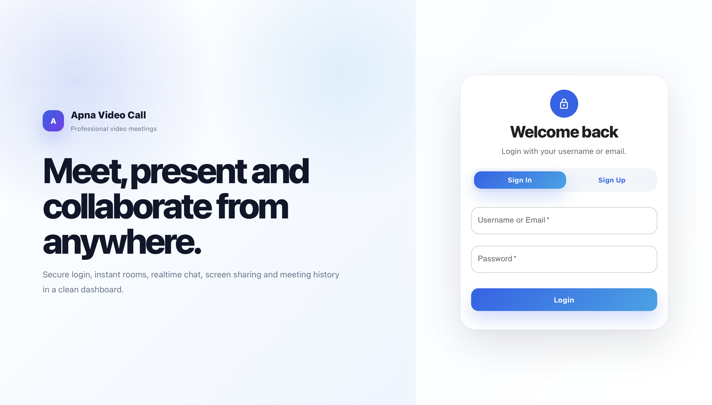

# Apna Video Call

Apna Video Call is a full-stack video meeting web application built with React, Node.js, Express, Socket.IO, WebRTC, and MongoDB Atlas.

Users can create meeting rooms, share public invite links, join video calls, chat in real time, and save meeting history.

## Live Demo

**Frontend:** https://frontend-one-snowy-92.vercel.app

**Backend:** https://apna-video-call-vmd6.onrender.com

**Sample Meeting:** https://frontend-one-snowy-92.vercel.app/meet-khushi

## Screenshots

### Home Page


### Signup / Login Page



## Features

* User signup and login
* Secure password hashing
* MongoDB Atlas database storage
* Create and join meeting rooms
* Public meeting invite links
* Real-time video calling with WebRTC
* Real-time chat with Socket.IO
* Meeting history storage
* Responsive professional UI
* Frontend hosted on Vercel
* Backend hosted on Render

## Tech Stack

**Frontend:** React.js, Material UI, CSS Modules, Vercel

**Backend:** Node.js, Express.js, Socket.IO, MongoDB Atlas, Mongoose, Render

## Project Structure

```text
apna-video-call/
├── backend/
├── frontend/
├── assets/
│   └── screenshots/
│       ├── homepage.png
│       └── signuppage.png
├── run-all.sh
├── run-public.sh
└── README.md
```

## Environment Variables

### Backend

```env
PORT=8000
MONGO_URI=your_mongodb_atlas_connection_string
CLIENT_URL=https://frontend-one-snowy-92.vercel.app
REQUIRE_DB=true
DB_NAME=apna_zoom_clone
```

### Frontend

```env
REACT_APP_BACKEND_URL=https://apna-video-call-vmd6.onrender.com
REACT_APP_PUBLIC_FRONTEND_URL=https://frontend-one-snowy-92.vercel.app
```

## Run Locally

### Backend

```bash
cd backend
npm install --legacy-peer-deps
npm run dev
```

### Frontend

```bash
cd frontend
npm install --legacy-peer-deps
npm start
```

## Database

MongoDB Atlas database:

```text
apna_zoom_clone
├── users
└── meetings
```

## How to Use

1. Open the frontend link.
2. Signup or login.
3. Create a new meeting.
4. Copy the meeting link.
5. Share it with another user.
6. Both users join the same link.
7. Allow camera and microphone.
8. Start the video meeting.


